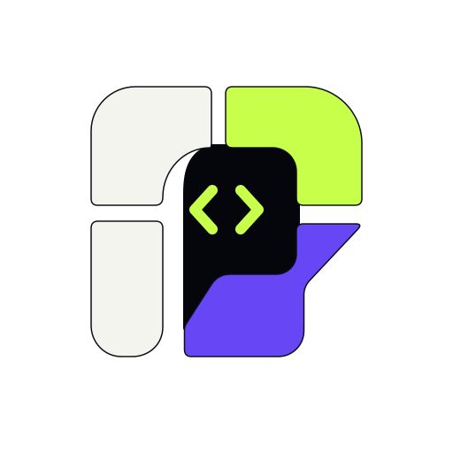
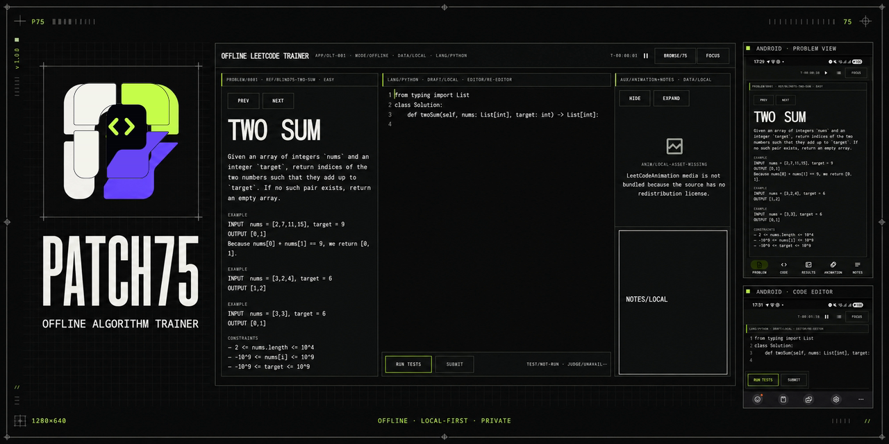
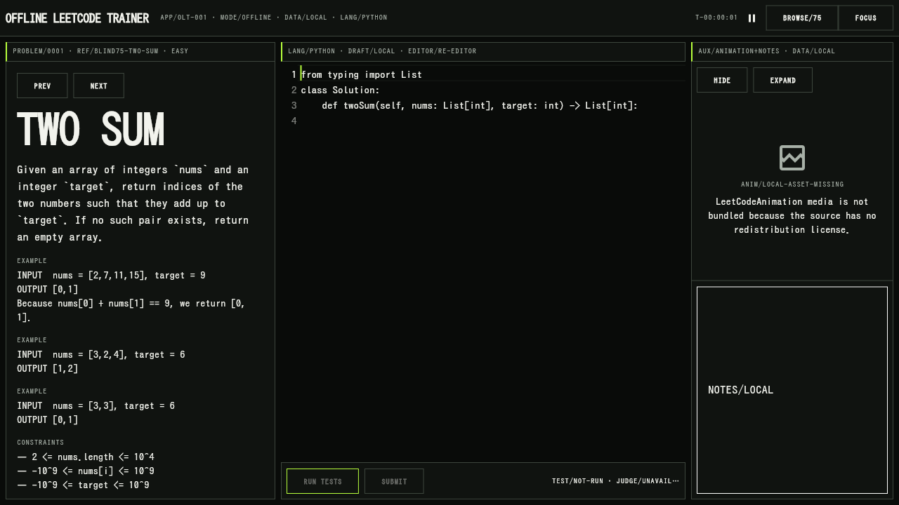
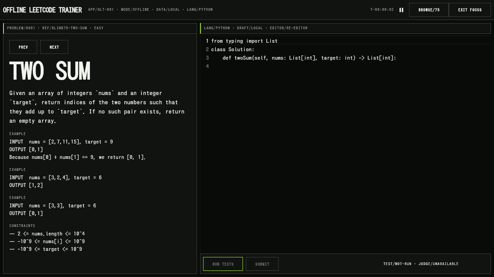
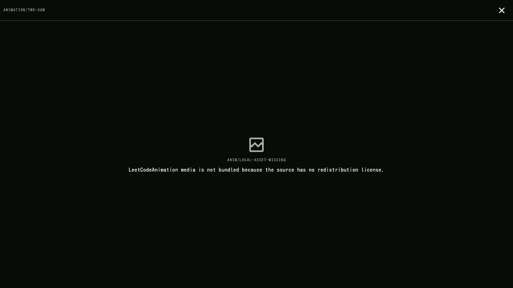
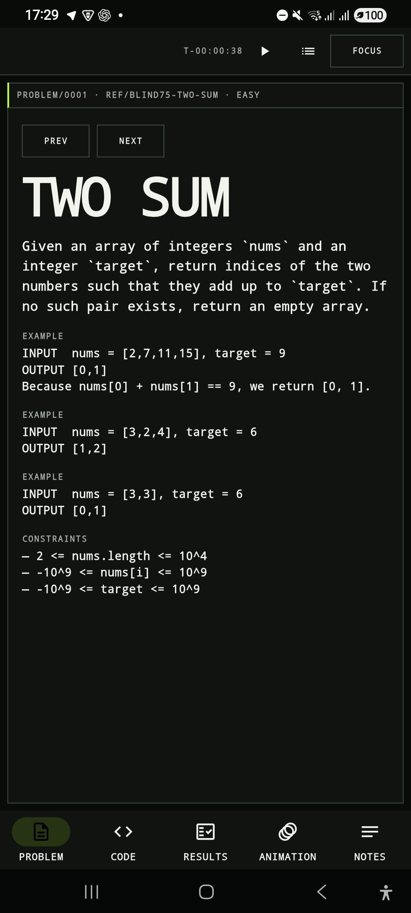
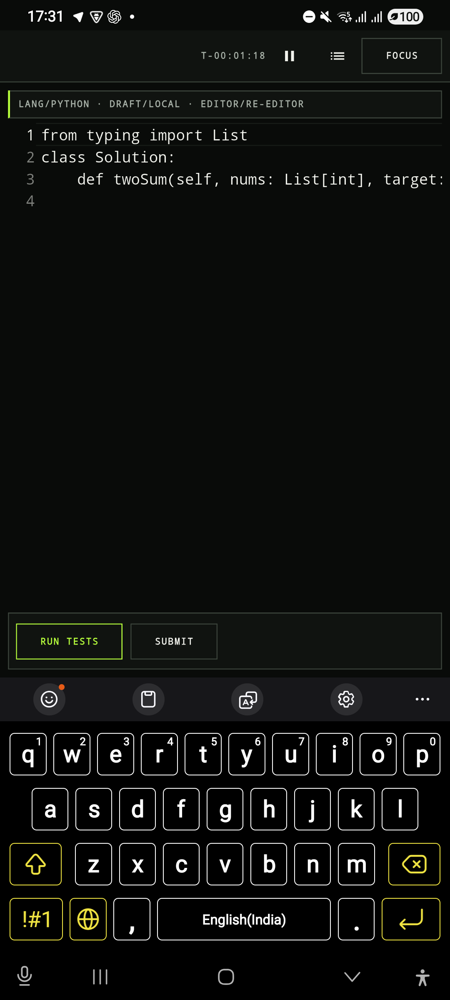
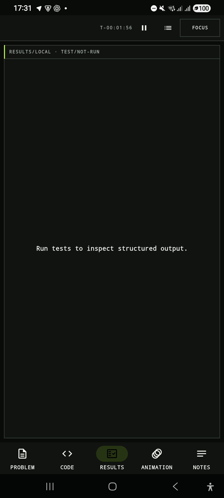
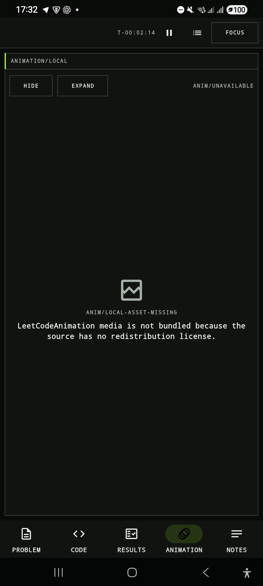

<p align="center">
  
</p>

<h1 align="center">Patch75</h1>

<p align="center">
  A private, offline-first Blind 75 algorithm trainer for Linux and Android.
</p>



<p align="center">
  <a href="https://github.com/abnzrdev/Patch75/releases/tag/v1.0.0">v1.0.0 release</a>
  ·
  <a href="https://github.com/abnzrdev/Patch75/releases/download/v1.0.0/Patch75-linux-x86_64-v1.0.0.tar.gz">Linux x86_64</a>
  ·
  <a href="https://github.com/abnzrdev/Patch75/releases/download/v1.0.0/Patch75-android-v1.0.0.apk">Android APK</a>
  ·
  <a href="https://github.com/abnzrdev/Patch75/releases/download/v1.0.0/SHA256SUMS">SHA-256 checksums</a>
</p>

## Train without the noise

Patch75 keeps the full practice loop on your device: browse the Blind 75,
understand the prompt, write Python, keep notes, run code, execute structured
tests, and schedule another review. There is no account, analytics, cloud sync,
or network requirement after installation.

| | |
|---|---|
| **75 offline problems** | Normalized prompts, examples, constraints, categories, and starter code ship with the app. |
| **Editor and notes** | Per-problem drafts, local notes, focus mode, timer, hints, and complexity checks. |
| **Run Code and Run Tests** | Freeform Python execution and structured test results on Linux and Android. |
| **Review that stays local** | Timed FSRS review queue, attempt history, and portable progress archives. |

## Real application screenshots

### Linux

| Workspace | Focus mode |
|---|---|
|  |  |



### Android

| Problem | Editor |
|---|---|
|  |  |

| Test results | Animation |
|---|---|
|  |  |

## Platform support

| Capability | Linux x86_64 | Android 7.0+ | Web |
|---|:---:|:---:|:---:|
| Browse and study all Blind 75 problems | Yes | Yes | Yes |
| Editor, drafts, notes, timer, and focus mode | Yes | Yes | Yes |
| Hints, complexity checks, and local materials | Yes | Yes | Yes |
| FSRS review queue and progress archive | Yes | Yes | Yes |
| Python Run Code and Run Tests | Docker bridge | Embedded Python | No |
| Offline after installation | Yes | Yes | Yes |
| v1.0.0 packaged release | tar.gz | APK | Source build |

## Privacy and security

- User code, drafts, notes, review history, and progress stay on the device.
- Patch75 has no login, telemetry, advertising, analytics, or cloud sync.
- Linux Python execution uses a locked-down local Docker container through a
  loopback-only bridge. Browsing and studying work without Docker.
- Android executes embedded Python in a non-exported separate service process
  with a seven-second host watchdog. This limits impact but is **not a secure
  sandbox for hostile Python**.
- Progress imports validate archive paths, sizes, versions, and checksums before
  merging local state.
- LeetCodeAnimation media is not redistributed because its source repository
  does not publish a redistribution license.

Read the detailed [security model](docs/SECURITY.md) and
[desktop judge notes](docs/DESKTOP_JUDGE.md).

## Install v1.0.0

GitHub authentication is required to download assets while this repository is
private.

### Linux x86_64

Docker is needed only for Run Code and Run Tests.

```bash
gh release download v1.0.0 \
  --repo abnzrdev/Patch75 \
  --pattern 'Patch75-linux-x86_64-v1.0.0.tar.gz'
tar -xzf Patch75-linux-x86_64-v1.0.0.tar.gz
cd Patch75
./install-linux.sh
patch75
```

From a source checkout, start the local judge in a second terminal when
executing Python:

```bash
docker pull python:3.13-alpine
scripts/start-desktop-judge.sh
```

Uninstall the application while preserving drafts, notes, and progress:

```bash
./uninstall-linux.sh
```

### Android

```bash
gh release download v1.0.0 \
  --repo abnzrdev/Patch75 \
  --pattern 'Patch75-android-v1.0.0.apk'
adb install -r Patch75-android-v1.0.0.apk
```

Android 7.0 / API 24 or newer is required. The v1.0.0 APK is intended for
authorized direct installation; no Play Store signing or distribution is
included.

### Verify downloads

Download all five release files into one directory, then run:

```bash
sha256sum -c SHA256SUMS
```

## Build from source

Requirements:

- Flutter 3.44.x and Dart 3.12.2
- Linux desktop toolchain
- Android SDK 36 and Java 21
- Docker for Linux Python execution

Load the pinned project environment before Flutter commands:

```bash
source scripts/flutter-env.sh
flutter pub get
flutter run -d linux
```

Required release verification:

```bash
source scripts/flutter-env.sh
dart format --output=none --set-exit-if-changed lib test integration_test tool
flutter analyze
flutter test
flutter build linux --release
flutter build apk --release
```

The Android App Bundle is optional for this direct-download release; v1.0.0
ships the verified APK.

See [Android setup](docs/ANDROID_SETUP.md),
[architecture](docs/ARCHITECTURE.md),
[performance](docs/PERFORMANCE.md), and
[third-party sources](docs/THIRD_PARTY.md) for implementation details and
recorded limitations.
